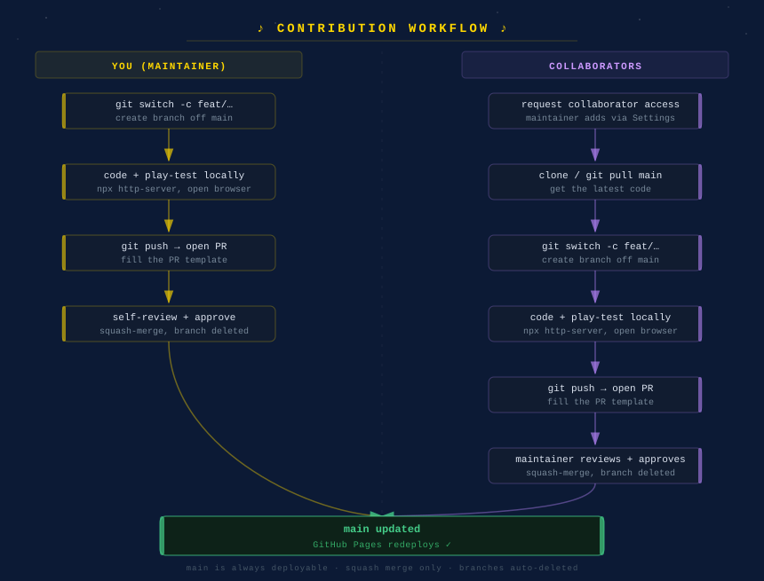

# Contributing to Ihdā': Shooo the Cooos!

Thanks for your interest in the project! This guide covers how work flows into
this repository — both for the maintainer working solo today, and for
collaborators joining later.

- **Live site:** https://kiruthikaaravindan.github.io/ihda/ (GitHub Pages, deployed from `main`)
- **Stack:** vanilla HTML5 Canvas + Web Audio API. No build tools, no frameworks, no dependencies.
- **Golden rule:** `main` is always deployable. Anything merged to `main` goes live.

---

## Workflow at a glance



---

## Table of Contents

1. [Ground rules for everyone](#ground-rules-for-everyone)
2. [Branch naming](#branch-naming)
3. [Commit messages](#commit-messages)
4. [Workflow — maintainer (solo)](#workflow--maintainer-solo)
5. [Workflow — collaborators](#workflow--collaborators)
6. [Pull requests](#pull-requests)
7. [Branch protection rules](#branch-protection-rules)
8. [Running locally](#running-locally)
9. [Security](#security)

---

## Ground rules for everyone

- **Never push directly to `main`.** All changes land through a pull request — even the maintainer's.
- **One logical change per branch/PR.** Small PRs are reviewed faster and revert cleanly.
- **Keep `main` deployable.** If a PR is half-finished, keep it in draft.
- **Never commit secrets** (tokens, keys). See [Security](#security).
- **Test in a browser before opening a PR** (see [Running locally](#running-locally)). This is a game — if it doesn't play, it isn't done.

---

## Branch naming

Use a `type/short-description` format with kebab-case:

| Prefix | Use for | Example |
|---|---|---|
| `feature/` | New gameplay, levels, mechanics | `feature/level-6` |
| `fix/` | Bug fixes | `fix/level-transition` |
| `chore/` | Tooling, config, cleanup | `chore/update-gitignore` |
| `docs/` | Docs only | `docs/update-readme` |

---

## Commit messages

- Write in the **imperative mood**: "Add pigeon dive attack", not "Added" / "Adds".
- **Subject line ≤ 72 chars**, capitalized, no trailing period.
- Add a body (blank line, then wrapped text) when the *why* isn't obvious from the subject.
- One commit = one coherent step. Squash merge keeps `main` history clean regardless, so don't stress over messy in-branch history.

Example:

```
Fix broken level transition in nextLevel()

Restore initLevel/applyCaesarForLevel/resetPlayer calls dropped in #4 so
advancing a level rebuilds geometry and repositions the player.
```

---

## Workflow — maintainer (solo)

Even working alone, go through a branch and PR so history stays clean.

```bash
git switch main && git pull
git switch -c fix/some-bug

# ... make changes, test in browser ...

git add -A
git commit -m "Fix some bug"
git push -u origin fix/some-bug

gh pr create --fill       # or open the PR from GitHub's UI
# review the diff yourself, then:
gh pr merge --squash --delete-branch
git switch main && git pull
```

---

## Workflow — collaborators

### 1. Get access

Ask the maintainer to add you as a **collaborator** (Repo → Settings → Collaborators).
Once accepted, you can push branches to this repo directly.

### 2. Clone and branch

```bash
git clone https://github.com/KiruthikaAravindan/ihda.git
cd ihda
git switch -c feature/your-thing
```

### 3. Build and test

Make your change, then **run it locally and play it** (see [Running locally](#running-locally)).

### 4. Open a pull request

```bash
git push -u origin feature/your-thing
gh pr create --fill     # or use GitHub's UI
```

Fill out the PR template. Target branch is `main`.

### 5. Review and merge

The maintainer reviews the PR, leaves comments if needed, then approves and squash-merges. The branch is deleted automatically. Address any comments with follow-up commits on the same branch — they show up in the PR immediately.

---

## Pull requests

Every PR gets a pre-filled checklist via the [PR template](.github/pull_request_template.md). The key requirements are:

- The branch is named correctly (`feature/…`, `fix/…`, `chore/…`, `docs/…`)
- You've play-tested it locally in a browser
- No secrets are committed
- `main` stays deployable — no half-broken states

For visual changes (canvas rendering, HUD, controls, layout), include a **before/after screenshot or clip** in the PR description.

---

## Branch protection rules

`main` is protected. Configured under **Settings → Branches → Branch protection rules** for `main`:

- ✅ **Require a pull request before merging** — no direct pushes
- ✅ **Require approvals (1)** — the maintainer must approve
- ✅ **Require branches to be up to date before merging**
- ✅ **Require conversation resolution before merging**

**Merge strategy — squash only** (Settings → General → Pull Requests): each PR becomes one commit on `main`. Enable "Allow squash merging", disable merge commits and rebase. Enable "Automatically delete head branches".

---

## Running locally

ES Modules require HTTP — open via a local server, not `file://`. Run from the repo root:

```bash
# Node
npx http-server -p 8000 -c-1

# Python (if installed)
python -m http.server 8000
```

Then open `http://localhost:8000/`.

---

## Security

- **Never commit tokens, API keys, or credentials.** Not in code, not in a `.txt` file, not in a git remote URL.
- Configure git auth with a credential helper or SSH — not by embedding a token in the remote URL.
- If a secret is ever committed, **rotate it immediately** — removing it from a later commit does not undo the exposure.
